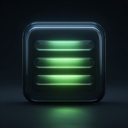

# Cyph3rfall

**Ambient Digital Rain for macOS** — a native menu bar app that fills your screen with cascading Matrix-style glyphs.



---

## What it is

Cyph3rfall lives in your menu bar and activates after a configurable idle period, covering every connected display with falling half-width katakana, digits, letters, and symbols. Dismiss instantly with any mouse or keyboard input.

Built entirely with Swift and AppKit — no screensaver frameworks, no sandboxing workarounds.

## Features

- **Menu bar agent** — no Dock icon, always accessible via the Ξ icon
- **Idle activation** — configurable timeout from 1 to 30 minutes (or never)
- **Multi-monitor** — covers every display simultaneously
- **Live settings preview** — see changes in real time before applying
- **9 colour presets** — Green, Amber, Cyan, White, Purple, Blue, Red, Orange, Pink
- **Density slider** — 10% to 500%, up to 5 overlapping streams per column
- **Launch at Login** — self-registers via SMAppService
- **Single instance enforcement** — no duplicate menu bar icons

## Requirements

- macOS 14.0 Sonoma or later
- [xcodegen](https://github.com/yonaskolb/XcodeGen) (to regenerate the .xcodeproj if needed)

## Building

```bash
git clone https://github.com/ikaazu/Cyph3rfall.git
cd Cyph3rfall
xcodegen generate
open Cyph3rfall.xcodeproj
```

Then select the **Cyph3rfall** scheme and press **⌘R**.

## Installation

1. Build the app in Xcode (⌘B)
2. Copy Cyph3rfall.app to /Applications
3. Launch it — the Ξ icon appears in the menu bar
4. Click **Ξ → Launch at Login** to start it automatically at login
5. Optionally set System Settings → Lock Screen → Start Screen Saver → Never

## Project structure

```
Shared/          Core rendering
  GlyphColumn.swift
  MatrixRainView.swift
  MatrixRainSettings.swift
  MatrixRainSettings+Defaults.swift
  PreferencesWindowController.swift

TestApp/         Menu bar application
  AppDelegate.swift
  FullScreenWindow.swift
  IdleWatcher.swift
  main.swift
  Info.plist
  Assets.xcassets/

project.yml      xcodegen project spec
```

## Credits

Inspired by *The Matrix* (1999, dir. Lana & Lilly Wachowski) and *MatrixMania* for Windows.
Built with Swift & AppKit by Greg Stock.

> *No screensaver frameworks were harmed.*
